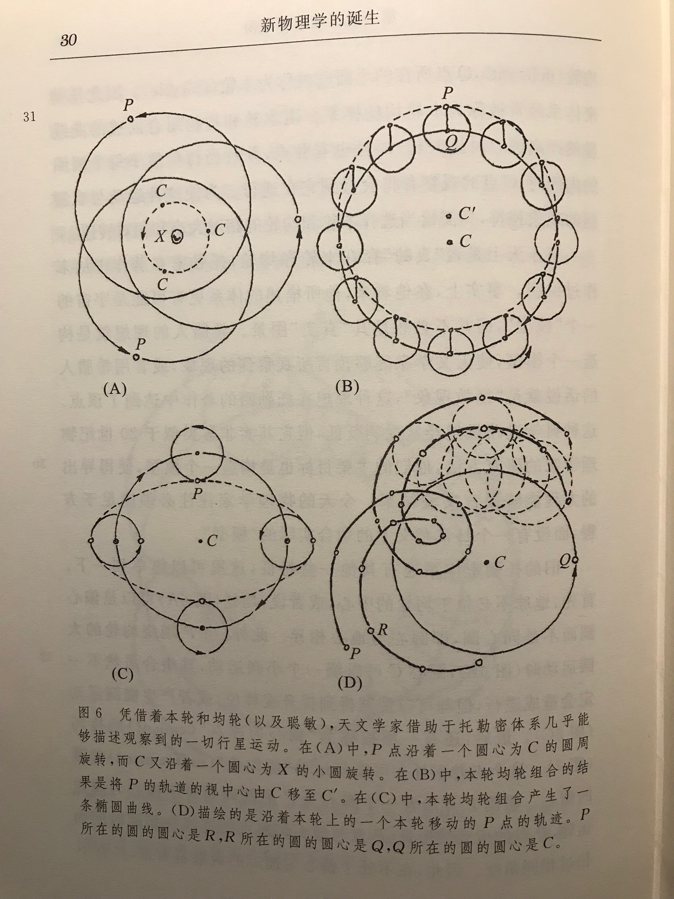

# G.R.Yang PhD Thesis Reading Notes

## What are dendrite-targeting interneurons? What are soma-targeting interneurons?

Dendrite-targeting interneurons are a type of interneuron (a type of neuron that serves as a connection between other neurons) that target the dendrites of other neurons. Dendrites are the branching processes of a neuron that receive input from other neurons and transmit this input to the cell body, or soma, of the neuron. Dendrite-targeting interneurons release neurotransmitters onto the dendrites of other neurons, which can modulate the activity of those neurons.

Soma-targeting interneurons are also a type of interneuron, but they target the soma (cell body) of other neurons instead of the dendrites. These interneurons release neurotransmitters onto the soma of other neurons, which can also modulate the activity of those neurons.

Both dendrite-targeting and soma-targeting interneurons play important roles in the function of the nervous system, and they are involved in a variety of physiological processes, including learning and memory, emotion, and movement.

## Whar does V1 mean in neuroscience?

In neuroscience, V1 stands for primary visual cortex, also known as area V1 or the striate cortex. It is the first area of the brain to process visual information in the cerebral cortex. V1 receives input from the retina of the eye and is responsible for early processing of visual stimuli, such as edge detection, color processing, and basic form recognition.

V1 is located in the occipital lobe of the brain, which is the part of the cortex that is responsible for processing visual information. The occipital lobe is located at the back of the head, and V1 is located in the posterior portion of the lobe.

V1 is a critical area of the brain for vision and is involved in many visual functions, including visual attention, perception, and visual memory. Dysfunction or damage to V1 can lead to visual impairments or deficits in visual processing.

## What are pyramidal neurons?

Pyramidal neurons are a type of neuron that is named for their distinctive pyramid-shaped cell body. They are the most common type of excitatory neuron in the brain, meaning that they transmit signals that excite or activate other neurons. Pyramidal neurons are found in many brain regions, including the cerebral cortex, hippocampus, and amygdala.

Pyramidal neurons have a complex structure that allows them to receive and integrate input from many other neurons and to send output to many other neurons as well. They have a cell body (soma) with a number of dendrites, which are branching processes that receive input from other neurons. The dendrites of a pyramidal neuron are typically highly branching and can receive input from hundreds or even thousands of other neurons. Pyramidal neurons also have a single axon, which is a long, thin process that sends output to other neurons. The axon of a pyramidal neuron can be quite long and can send output to neurons in other brain regions or even in other parts of the body.

Pyramidal neurons play a key role in the function of the nervous system and are involved in many physiological processes, including learning and memory, emotion, and movement. Dysfunction or damage to pyramidal neurons can lead to a variety of neurological and psychiatric disorders.

## What is the visual area MT?

The full name of MT is the middle temporal area (it is also sometimes referred to as V5 or area MT+). The Visual area MT (also known as V5 or area MT+), is a region of the brain that is involved in the processing of visual motion. It is located in the occipital lobe, which is the part of the cerebral cortex that is responsible for processing visual information. MT is connected to the retina of the eye and receives input from other areas of the brain that are involved in visual processing, such as V1 (primary visual cortex).

MT is thought to play a key role in the perception of motion and the ability to track moving objects. It is also involved in the computation of the direction and speed of moving stimuli, as well as the integration of visual and vestibular (balance and orientation) information. Dysfunction or damage to MT can lead to impairments in the perception of motion and other visual deficits.

## What does "temporal" mean?

The word "temporal" refers to the temples (the sides of the head) or the temples of the skull, as well as to the temporal region of the brain. In neuroscience, the term "temporal" is often used to refer to the temporal lobe, which is one of the four lobes of the cerebral cortex (the others are the frontal lobe, parietal lobe, and occipital lobe). The temporal lobe is located on the sides of the brain, above the ears.

The temporal lobe is involved in a variety of functions, including hearing, language, memory, and emotion. It contains a number of important brain structures, including the hippocampus, which is involved in memory formation, and the amygdala, which is involved in the processing of emotions. Dysfunction or damage to the temporal lobe can lead to a variety of neurological and psychiatric disorders, including memory problems and changes in mood and behavior.

## So, the MT is not in the temporal lobe but in the occipital lobe?

That's correct! MT, which stands for middle temporal area, is a region of the brain that is involved in the processing of visual motion. It is located in the occipital lobe, which is the part of the cerebral cortex that is responsible for processing visual information. The occipital lobe is located at the back of the head, while the temporal lobe is located on the sides of the brain, above the ears.

## What are they: cells expressing parvalbumin (PV), somatostatin (SOM or SST), and the serotonin receptor 5HT3a

(5HT3aR)？

Parvalbumin (PV) is a calcium-binding protein found in certain types of neurons, or nerve cells, in the brain. It is involved in the regulation of the neurotransmitter GABA, which helps inhibit, or reduce, the activity of other neurons.
Somatostatin (SST) is another type of neurotransmitter that is found in certain neurons in the brain and throughout the body. It helps to inhibit the secretion of hormones and other substances, such as insulin and glucagon, from the endocrine glands.
The serotonin receptor 5HT3a (5HT3aR) is a protein that is found on the surface of certain neurons and functions as a receptor for the neurotransmitter serotonin. Serotonin is involved in the regulation of mood, appetite, sleep, and other functions. When serotonin binds to the 5HT3a receptor, it can activate or inhibit the activity of the neuron depending on the specific circumstances.

## What are SST-positive neurons?

SST-positive neurons refers to nerve cells (neurons) that express the gene for somatostatin (SST) and produce the somatostatin peptide hormone. These neurons are found in various regions of the brain and in other parts of the body, including the hypothalamus and the gut.

In the hypothalamus, SST-positive neurons are found in several nuclei, such as the periventricular nucleus, the arcuate nucleus and the dorsal hypothalamic area. These neurons play a critical role in regulating hormone secretion, hunger and satiety, stress response, and other physiological functions.

In the gut, SST-positive neurons are found in the enteric nervous system (ENS) and can modulate the release of other hormones and neurotransmitters, regulate gastrointestinal motility, and control the secretions of digestive enzymes and fluids.

SST-positive neurons can be identified by immunohistochemistry, which is a technique that uses antibodies that specifically bind to SST protein and allows the visualization of these cells. This method is commonly used in research to study the distribution and functions of SST-positive neurons in the brain and other parts of the body.

## What is a peptide?

A chemical compound that is made of a small chain of two or more amino acids

肽是两个或两个以上氨基酸以肽链相连的化合物，是介于大分子蛋白质和小分子氨基酸之间的一段最具活性、最易吸收、最能激发人体再生系统的功能性营养。肽是构成人体内酶、激素、抗体、神经间质等活性物质不可替代的材料，是生命之源。肽具有原蛋白质和单体氨基酸不具备的独特的生理活性和医疗保健作用，具备营养、保健、治疗三重功能。

## What are the epicycle and deferent?

epicycle: (in the Ptolemaic system) a small circle, around which a planet was thought to revolve, whose centre describes a larger circle (the **deferent**) centred on the earth (托勒密体系)本轮

deferent: (in the Ptolemaic system) a circle centred on the earth around which the centre of the epicycle was thought to move (托勒密体系)均轮; 以地球为中心的一个圆，本轮中心绕此圆移动

本轮和均轮模拟出的椭圆-对应论文第9页最上面的一句话

